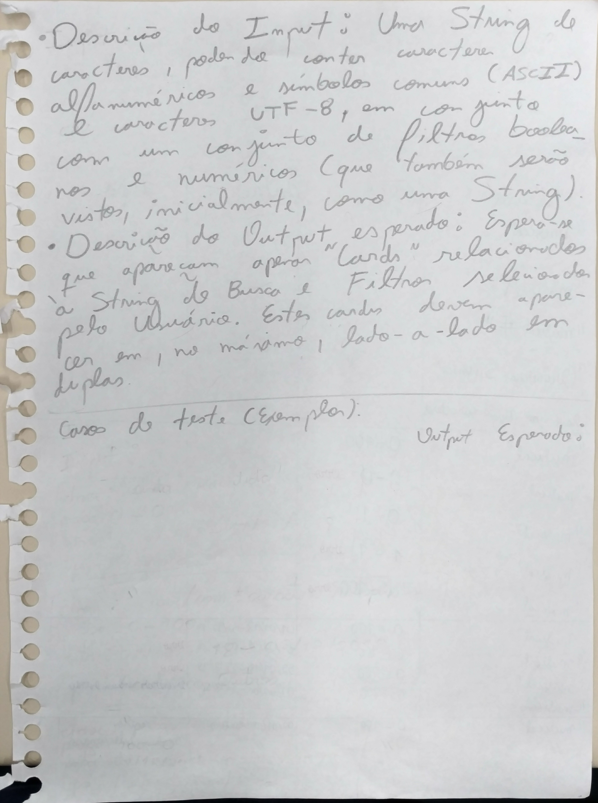
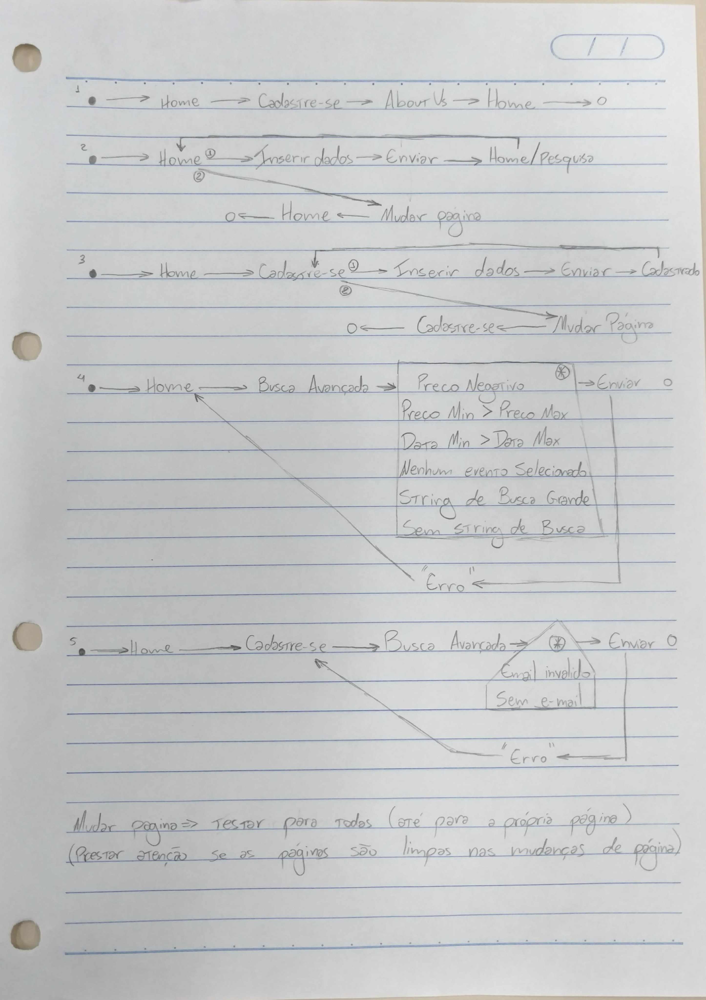

Plano de Testes
===

1 Identificação
---

- Projeto: Entretenibit

- Equipe:
	
	- Bruno Coelho
	
	- Felipe Siqueira
	
	- Gabriel Cruz

	- Marcello Pagano

	- Matheus Saldanha

	- Tiago Miranda

- Data de criação: 15/06/2018

2 Introdução e Planejamento
---

O projeto é composto pelos módulos Robot, Frontend, Server e Database. O Robot é o módulo que realiza o web scraping de páginas da web pré-definidas e deposita os dados no banco de dados. O Frontend é a parte da interface web com o usuário e consiste em arquivos HTML, CSS e Javascript a serem servidos. O Server é reponsável por servir a página da web. A Database é o servidor de banco de dados onde são armazenados os dados sobre eventos obtidos via web scraping.

O Robot recebe como entrada páginas HTML dos web sites pré-definidos, e sua saída são dados de eventos, os quais são adicionados no banco de dados. Pretende-se testar este módulo por meio de páginas HTML dos web sites pré-definidos, salvos localmente, independentemente de estarem atualizados ou não. O teste consiste em fazer o scraping dessas páginas e comparar sua saída com uma saída esperada, definida por nós.

O website/Frontend pode ser visto como uma máquina de estados, onde cada estado representa uma página da web onde o usuário se encontra. Pretende-se testar essa máquina de estados percorrendo-se as transições de estados seguindo algum critério. Além disso, o Frontend possui a funcionalidade de busca de eventos seguindo um dado filtro. A entrada para essa busca são as configurações dos filtros, assim como a chave de busca; e a saída são os eventos relacionados à chave de busca dada e que se adeque aos filtros definidos. Pretende-se testar essa busca por meio de testes funcionais e testes de análise do valor limite.

O módulo Server serve somente um único arquivo HTML (o próprio javascript desse HTML é responsável pela transição entre diferentes páginas). Pretende-se testar este módulo verificando-se se a página é devidamente servida.

Não pretende-se testar o módulo Database diretamente, pois sua funcionalidade já estará sendo testada junto com a busca no Frontend.

3 Projeto dos Casos de Teste
---

### Planejamento de Teste do Frontend

#### Descrição do Input/Output da Busca

#### Casos de Teste da Busca

#### Casos de Teste da Máquina de Estado

